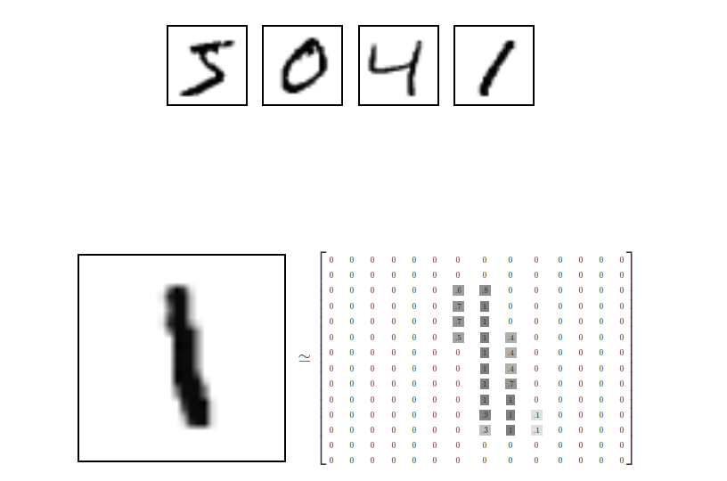
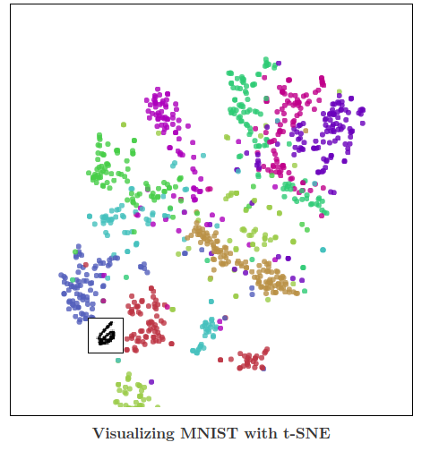
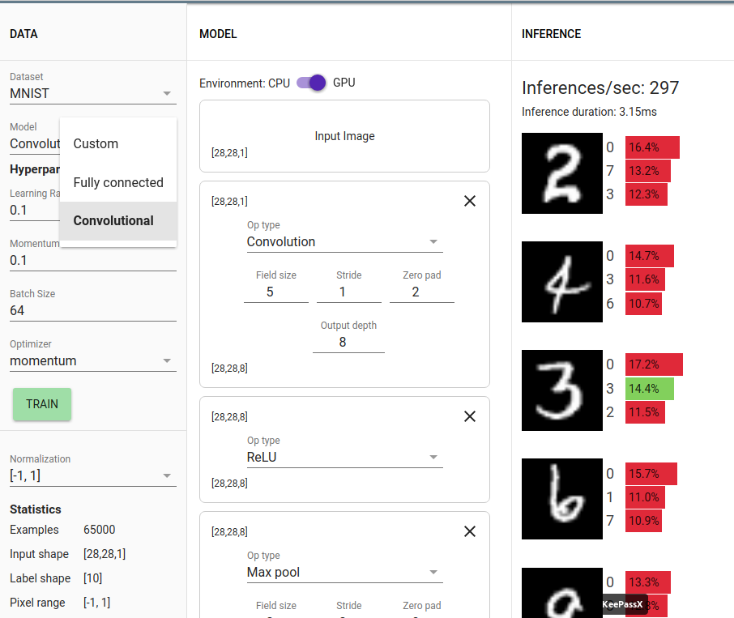

% Take a tour of some online AI examples
% {height=40 style=vertical-align:middle} jjmontes@gmail.com - {height=40 style=vertical-align:middle} jjmontesl
% VigoBrain 2017 (*CC BY-SA 3.0*)

# Take a tour of some online AI examples

## Online AI examples

- Quickly see some concepts in action
- Meet common datasets and problems
- Explore typical metaparameters
- Plenty of examples online

---

{width=100%}

# Genetic Algorithms

## Genetic cars

{width=100%}

---

### Genetic cars

- Genetic algorithm used to evolve cars that fit a terrain.
- Genome is...
    - shape (8 vertex)
    - wheel size, position and density
    - body density

[Genetic Algorithm 2D Car Thingy](http://rednuht.org/genetic_cars_2) \
[Genetic 3 Wheelers](http://www.whiletrue.it/genetic_3-wheelers/)

# Understanding Datasets

---

{width=100%}

---

An interactive guide to visualizing the MNIST dataset using
various dimensionality reduction techniques:

* PCA (Principal Component Analysis) - Linear Combinations
* MDS (Multidimensional Scaling) - Distance
* t-SNE (t-Distributed Stochastic Neighbor Embedding) - Topology

[Visualizing MNIST](http://colah.github.io/posts/2014-10-Visualizing-MNIST/)

---

# ANN

## ConvnetJS

[ConvnetJS](https://github.com/karpathy/convnetjs) is a Javascript implementation of *neural networks*, together with nice *browser-based demos*.

_(Currently unmaintained)_

Allows code to be altered in the browser.

* [Classify MNIST Digits](http://cs.stanford.edu/~karpathy/convnetjs/demo/mnist.html)
* [Classify CIFAR-10 Images](http://cs.stanford.edu/~karpathy/convnetjs/demo/cifar10.html)
* [Reinforcement Learning](http://cs.stanford.edu/people/karpathy/convnetjs/demo/rldemo.html)
* [Image regression](http://cs.stanford.edu/~karpathy/convnetjs/demo/image_regression.html)

[ConvnetJS](https://github.com/karpathy/convnetjs)

## Deeplearn.js

Hardware-accelerated machine intelligence library for the web.

[Deeplearn.js Model Builder Demo](https://deeplearnjs.org/demos/model-builder/)

[Deeplearn.js](https://deeplearnjs.org)

---

# Your turn!

## Thanks!

{height=40 style=vertical-align:middle} jjmontes@gmail.com \
{height=40 style=vertical-align:middle} jjmontesl

