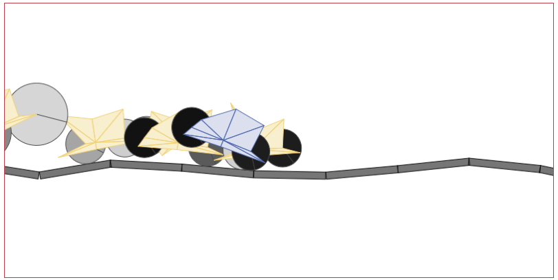

% Take a tour of some online AI examples
% {height=40 style=vertical-align:middle} jjmontes@gmail.com - {height=40 style=vertical-align:middle} jjmontesl
% VigoBrain 2017 (*CC BY-SA 3.0*)

# Take a tour of some online AI examples

## Online AI examples

- Quickly see some concepts in action
- Meet common datasets and problems
- Explore typical metaparameters
- Plenty of examples online

---

{width=100%}

# Genetic Algorithms

## Genetic cars

{width=100%}

---

### Genetic cars

- Genetic algorithm used to evolve cars that fit a terrain.
- Genome is...
    - shape (8 vertex)
    - wheel size, position and density
    - body density

[Genetic Algorithm 2D Car Thingy](http://rednuht.org/genetic_cars_) \
[Genetic 3 Wheelers](http://www.whiletrue.it/genetic_3-wheelers/)

## Data visualization ?

## ANN

* ConvnetJS

* ...

## Now it's your turn

{height=40 style=vertical-align:middle} jjmontes@gmail.com \
{height=40 style=vertical-align:middle} jjmontesl
